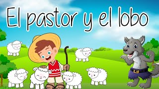

# Pagina enlazada 2


Pagina enlazada.

## El pastor y el lobo



Había una vez un joven pastor que todos los días llevaba a su rebaño a pastar. Como se aburría muchísimo, decidió gastar una broma a los campesinos del lugar.

—¡Que viene el lobo! ¡Auxilio! ¡Mis ovejas!

Los campesinos corrieron a ayudarle, pero no vieron ni rastro del lobo. El joven pastor rio a carcajadas, mientras los campesinos se alejaban muy enfadados. Una semana después, el pastor volvió a gastarles la misma broma. 

Hasta que un día, el pastor vio acercarse a un lobo. Aterrorizado, gritó pidiendo auxilio. Pero esta vez, los campesinos no le creyeron y el pastor se quedó sin su rebaño.

Moraleja: Nadie cree al mentiroso cuando dice la verdad. Esta es otra de las mejores fábulas de Esopo y nos enseña que si mentimos, nadie confiará en nosotros cuando digamos la verdad.
Para navegar o regresar siga los links de abajo...

Bryan Aguirre 100-RED.

```{tableofcontents}
```